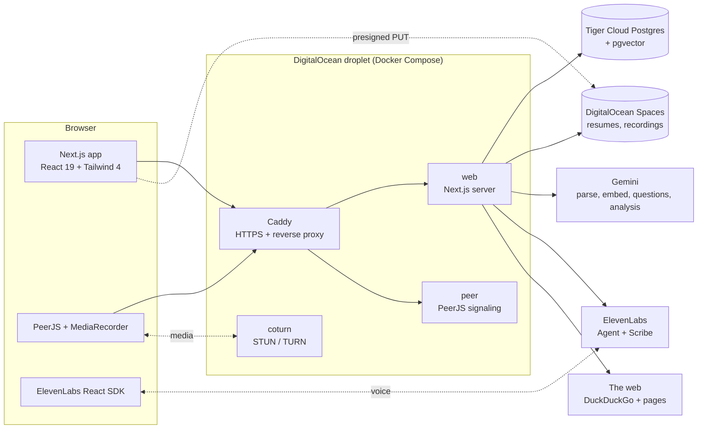

<p align="center">
  
</p>

<p align="center">
  <strong>Rehearse the interview you're actually walking into.</strong><br>
  Company-specific mock interviews with an AI interviewer or a real person, and feedback you can act on.
</p>

<p align="center">
  <a href="https://hiremealready.study">hiremealready.study</a> ·
  <a href="docs/PLAN.md">Build plan</a> ·
  <a href="DESIGN.md">Design system</a> ·
  <a href="PRODUCT.md">Product brief</a>
</p>

---

Most mock-interview tools ask the same generic questions to everyone. Hire Me Already starts from the job you're applying for. It searches the web for questions candidates say they were asked at that company, keeps only the ones it can verify on the source page, and fills the rest from the role, the job description and your resume. You can then practice against a voice AI interviewer, or get matched with another person whose background is close to yours. After the call you get a transcript, a scored analysis and, for human interviews, written feedback from your interviewer.

Built at **ShellHacks**.

## Features

**AI interview**
- Enter a company, job title and (optionally) the job description. Questions are grounded in scraped, verified reports where they exist, and every question shows its source.
- A voice interviewer (ElevenLabs Agent running on Gemini) asks them live, with follow-ups, while your camera runs as it would in a real call.
- When the call ends, the transcript is pulled from ElevenLabs and Gemini scores the interview: an overall score, ratings for communication, structure, technical depth and relevance, strengths and things to improve, and feedback on every answer.

**Live interview with a person**
- Join the queue as an interviewee or an interviewer. You're paired with someone in the opposite role, closest resume first (pgvector similarity), falling back to first come, first served.
- Peer-to-peer video over WebRTC, relayed through our own TURN server when networks block direct connections.
- The interviewer sees the candidate's resume, a list of suggested company-specific questions, and a notes panel.
- Both browsers record the call (with consent). The recording is transcribed by ElevenLabs Scribe and analyzed by Gemini, and the interviewer leaves structured feedback in the wrap-up.
- No match within two minutes? You're offered AI practice instead.

**Everything around it**
- Resume upload with Gemini parsing into skills, experience and a summary you can edit.
- History with the full transcript, analysis and feedback for every interview.
- Friends: search, requests, and direct interview invitations.
- In-app notifications (friend activity, results ready, feedback received, resume parsed).
- Report a user from inside a call, with an admin review queue at `/admin/reports`.
- Light and dark themes, account and data deletion.

## How it works



### Company research that doesn't make things up

`generateQuestions()` in [src/lib/gemini/index.ts](src/lib/gemini/index.ts) searches DuckDuckGo for interview reports about the company and role ([src/lib/scrape.ts](src/lib/scrape.ts)), then asks Gemini to classify each page and quote the questions it contains. A quoted question is kept only if:

1. at least 80% of its four-word runs appear verbatim in the page text,
2. Gemini judged the page firsthand or company-specific, not a generic list, and
3. the page names the company.

With fewer than two verified questions, the scrape isn't trusted and every question is written from the role, job description and resume instead. Either way, each question carries its source (`company`, `job`, or `general`) and, when scraped, its URL.

### Matching

`/practice/live` polls `GET /api/queue` every 2 seconds. Each poll is both a heartbeat and a match attempt ([src/lib/matching.ts](src/lib/matching.ts)): the partner is someone waiting in the opposite role who polled in the last 15 seconds, ordered by resume-embedding distance and then by time in the queue. Both queue rows are locked in one transaction, so two simultaneous polls can't double-match. A match creates a `PEER` interview, and the interviewer's suggested questions are generated in the background.

If a matched partner stops polling for 90 seconds (long enough to survive a throttled background tab) or cancels, the other person goes back to the front of the line.

### After the call

[src/lib/pipeline/finalize.ts](src/lib/pipeline/finalize.ts) runs in the background through `after()` once an interview ends:

- **AI mode:** fetches the conversation transcript from ElevenLabs, polling until it's processed.
- **Peer mode:** each browser uploads a stereo recording (its own mic on one channel, the other person on the other) straight to Spaces through a presigned URL. The pipeline sends one to ElevenLabs Scribe in multichannel mode, which yields a speaker-labeled transcript.
- Gemini analyzes the transcript against the interview's questions, and the candidate is notified that results are ready.

A failed run leaves the interview `FAILED` and can be retried with `npx tsx scripts/refinalize.mts <interviewId>`.

## Tech stack

| Layer | Choice |
|---|---|
| App | [Next.js 16](https://nextjs.org) (App Router, TypeScript), React 19 |
| Styling | Tailwind CSS 4 with a hand-built design system ([DESIGN.md](DESIGN.md)), no UI kit, [lucide](https://lucide.dev) icons |
| Auth | [Better Auth](https://www.better-auth.com): email/password and Google |
| Database | [Prisma 7](https://www.prisma.io) → [Tiger Cloud](https://www.tigerdata.com) Postgres with pgvector |
| Storage | DigitalOcean Spaces (S3 API, presigned uploads) |
| AI | [Gemini](https://ai.google.dev) for resume parsing, embeddings, question generation and analysis |
| Voice | [ElevenLabs](https://elevenlabs.io) Agents for the AI interviewer, Scribe for peer-call transcription |
| Video | [PeerJS](https://peerjs.com) (self-hosted signaling) + [coturn](https://github.com/coturn/coturn) |
| Validation | [zod](https://zod.dev) schemas shared between client and server |
| Hosting | Docker Compose + [Caddy](https://caddyserver.com) on a DigitalOcean droplet |

## Getting started

### Prerequisites

- Node.js 22
- A Postgres database with the `vector` extension (we use Tiger Cloud)
- API keys for Gemini and ElevenLabs, and a DigitalOcean Spaces bucket (or any S3-compatible store)

### Setup

```bash
npm install               # also runs `prisma generate`
cp .env.example .env      # fill in the values (see below)
npm run db:deploy         # apply migrations to the database in DATABASE_URL
npm run db:seed           # optional: demo accounts and two finished interviews
npm run dev               # http://localhost:3000
```

The seed creates an interviewee, an interviewer and an admin, and prints their logins when it finishes. Re-running it replaces those accounts from scratch.

### Environment variables

Everything is documented inline in [.env.example](.env.example). The short version:

| Variable | Notes |
|---|---|
| `DATABASE_URL` | Postgres connection string with `sslmode=require` |
| `BETTER_AUTH_SECRET` | `openssl rand -hex 32` |
| `BETTER_AUTH_URL` | `http://localhost:3000` locally, `https://hiremealready.study` in production |
| `GOOGLE_CLIENT_ID` / `GOOGLE_CLIENT_SECRET` | OAuth client with redirect URI `<BETTER_AUTH_URL>/api/auth/callback/google` |
| `SPACES_*` | Key, secret, bucket, region and endpoint for DigitalOcean Spaces |
| `GEMINI_API_KEY`, `GEMINI_MODEL`, `GEMINI_EMBED_MODEL` | Model defaults are in `.env.example` |
| `ELEVENLABS_API_KEY`, `ELEVENLABS_AGENT_ID` | The agent id comes from `npm run agent:sync` and is shared by the team |
| `TURN_SECRET`, `TURN_HOST` | Must match the droplet's, because local dev uses the production TURN server |
| `NEXT_PUBLIC_PEER_*` | PeerJS host, port and path (production values by default) |
| `LOG_LEVEL` | `debug`, `info` (default), `warn` or `error` |

> [!NOTE]
> Local development uses the **production** PeerJS and coturn servers, so video calls work from `localhost` as long as your `TURN_SECRET` matches the droplet's. Ask the team for it; it isn't committed.

### Scripts

| Command | What it does |
|---|---|
| `npm run dev` | Start the dev server |
| `npm run build` / `npm start` | Production build and server |
| `npm run lint` / `npm run typecheck` | ESLint and `tsc --noEmit` |
| `npm run db:migrate` | Create and apply a new migration after editing `prisma/schema.prisma` |
| `npm run db:deploy` | Apply existing migrations (everyone, and production) |
| `npm run db:vector-index` | Create the HNSW index on `resume.embedding` (optional, re-runnable) |
| `npm run db:studio` | Browse the data in Prisma Studio |
| `npm run db:seed` | Load demo accounts and interviews |
| `npm run agent:sync` | Push the AI interviewer's config to ElevenLabs (creates it the first time) |
| `npx tsx scripts/try-questions.mts "<company>" "<role>"` | Run company research and question generation from the terminal |
| `npx tsx scripts/try-gemini.mts [--grounded]` | Smoke-test the embedding, question and analysis calls |
| `npx tsx scripts/refinalize.mts <id>` | Re-run the post-interview pipeline for one interview |

## Project structure

```
src/
├── app/
│   ├── (auth)/            login and signup
│   ├── (app)/             signed-in screens: practice (home), friends, history, resume, settings, admin
│   ├── onboarding/        first-run profile and resume
│   ├── call/[id]/         lobby, live call (AI or peer) and wrap-up
│   ├── rtc-test/          network check for WebRTC
│   └── api/               route handlers (auth, profile, resume, queue, interviews, ai, friends, ...)
├── components/
│   ├── ui/                design-system primitives
│   ├── shell/             app shell: sidebar, top bar, theme and role toggles
│   └── call/              video tiles, controls, AI orb, interviewer panel, report dialog
└── lib/
    ├── contracts.ts       zod schemas and types shared by client and server
    ├── gemini/            resume parsing, embeddings, company research, analysis
    ├── elevenlabs/        interviewer agent config, signed URLs, transcripts, Scribe
    ├── pipeline/          post-interview finalize job
    ├── rtc/               PeerJS call hook, local media, call recorder
    ├── matching.ts        queue matching
    └── ...                auth, db, storage, notifications, friends, reports
prisma/                    schema and migrations
peer-server/               PeerJS signaling image
coturn/                    TURN server config
scripts/                   seed, deploy, agent sync, dev tools
```

## Development notes

### Conventions

- Route Handlers wrap their body in `handleRoute` ([src/lib/api.ts](src/lib/api.ts)) and call `requireUser()` ([src/lib/session.ts](src/lib/session.ts)) for auth. Errors come back as `{ error: string }`.
- Validate request bodies with the zod schemas in [src/lib/contracts.ts](src/lib/contracts.ts).
- The Prisma client is generated into `src/generated/prisma` (gitignored). Import the shared instance from `@/lib/db`.
- `resume.embedding` is a pgvector column Prisma can't read or write. Use [src/lib/vector.ts](src/lib/vector.ts).
- Client components get the signed-in user from `useCurrentUser()`. The `(app)`, `call` and `onboarding` layouts provide it after `requirePageUser()` checks the session.
- Screens load data with `useApiResource` ([src/lib/use-api.ts](src/lib/use-api.ts)), which returns `{ status, data, retry }`. Add `?state=loading|empty|error` to a URL (or use the State preview button) to force a screen's loading, empty or error state for review. Route responses are shaped for the screens by the mappers in [src/lib/views.ts](src/lib/views.ts).
- **Adding a background job? Call `notify()`** ([src/lib/notifications.ts](src/lib/notifications.ts)) when it finishes. It's best-effort: a failed insert is logged and never breaks the action itself. The top bar polls `GET /api/notifications` every 30 seconds.
- This project runs a Next.js version newer than most documentation. Check `node_modules/next/dist/docs/` before relying on an API (see [AGENTS.md](AGENTS.md)).
- Work on feature branches and open PRs into `main`.

### AI interviewer

The interviewer's prompt, first message, LLM, end-call tool and limits live in [src/lib/elevenlabs/interviewer-agent.ts](src/lib/elevenlabs/interviewer-agent.ts). After editing it, run `npm run agent:sync`.

- Sessions need a signed URL from our server (`getSignedUrl()`), so the agent can't be used from outside the app.
- Each session fills `{{candidate_name}}`, `{{job_title}}`, `{{company}}`, `{{resume_summary}}` and `{{questions}}` (see `InterviewVariables`).
- The ElevenLabs account is on the free plan, so conversation minutes are scarce. Test with the `text_only` override where you can.

### WebRTC

- **Signaling:** a self-hosted PeerJS server ([peer-server/](peer-server/)), reached through Caddy at `/peerjs`.
- **TURN/STUN:** coturn ([coturn/turnserver.conf](coturn/turnserver.conf)) on 3478 (UDP and TCP), relay ports 49160–49200.
- **Credentials:** `GET /api/turn-credentials` (signed-in users only) returns ICE servers with short-lived TURN credentials signed by `TURN_SECRET`.
- **Client:** `usePeerCall` ([src/lib/rtc/use-peer-call.ts](src/lib/rtc/use-peer-call.ts)) handles camera and mic, dialing and redialing, answering and hang-up, and reports whether media goes direct or through the relay. The interviewer dials.
- **Call lifecycle:** `PATCH /api/interviews/{id}/peer` records `connected` (the first one marks the interview active) and `left` (completed, or abandoned if it never started). After a real conversation both people go to `/call/{id}/wrap-up`.

**Before a demo, check the network.** Open [hiremealready.study/rtc-test](https://hiremealready.study/rtc-test) on two devices, join the same room as A and B, and leave "Force TURN relay" on. "Path: TURN relay" with video both ways means calls will work on that network.

<details>
<summary><strong>Workstreams and file ownership</strong> (how the team split the hackathon build)</summary>

<br>

Only the owning stream edits these paths. Ask in team chat before changing something elsewhere.

| Stream | Owns |
|---|---|
| **A: Infra and realtime** | `docker-compose.yml`, `Caddyfile`, `coturn/`, `Dockerfile`, `src/lib/rtc/`, `src/app/api/turn-credentials/`, `src/app/call/`, `src/app/rtc-test/`, `src/components/call/` |
| **B: Data, auth, matching** (William) | `prisma/`, `src/proxy.ts`, `src/lib/{db,auth,auth-client,session,api,storage,vector,contracts,matching}.ts`, `src/app/api/{auth,profile,resume,queue,interviews,friends,messages,invitations}/` |
| **C: AI** | `src/lib/gemini/`, `src/lib/elevenlabs/`, `scripts/sync-agent.mts`, `src/lib/pipeline/`, `src/app/api/ai/`, `src/app/(app)/practice/ai/` |
| **D: Product UX** | `DESIGN.md`, `PRODUCT.md`, `src/app/{layout.tsx,page.tsx,globals.css,not-found.tsx}`, `src/app/(auth)/`, `src/app/onboarding/`, `src/app/(app)/` (except `practice/ai/`), `src/components/{ui,shell}/`, `src/components/*.tsx`, `src/lib/{cn,mock,mock-state,prefs,theme-script}.ts` |

The UI started as the [hire-me-already](https://github.com/alejandro0955/hire-me-already) mockup. Every screen now reads from the database; [src/lib/mock.ts](src/lib/mock.ts) only keeps shared types, constants like `reportReasons`, and the design-preview call ids in `callSessions`.

</details>

## Deployment

Production runs on a single DigitalOcean droplet (Ubuntu 24.04, 2 vCPU / 4 GB) at **[hiremealready.study](https://hiremealready.study)**, with four Compose services:

| Service | Role |
|---|---|
| `caddy` | HTTPS with automatic Let's Encrypt certificates, redirects `www` and plain HTTP, proxies `/peerjs` to `peer` and everything else to `web` |
| `web` | The Next.js standalone build |
| `peer` | PeerJS signaling server |
| `coturn` | STUN/TURN, on host networking for its public IP and UDP relay range |

To deploy:

```bash
scripts/deploy.sh
```

This rsyncs your working tree to `/opt/hiremealready` on the droplet and runs `docker compose up -d --build` there, which takes 2–3 minutes. There's one shared production, so deploy from a branch that's merged or about to be.

- The droplet has its **own** `.env` at `/opt/hiremealready/.env`, which deploys never overwrite. To change a value, edit it there and redeploy.
- `NEXT_PUBLIC_*` variables are baked in at build time, so changing one needs a rebuild, not just a restart.
- Logs: `ssh root@104.131.187.142 'cd /opt/hiremealready && docker compose logs -f web'`

> [!WARNING]
> **Docker-published ports bypass `ufw`.** In `docker-compose.yml`, only Caddy may use `ports:` (80/443). Every other service uses `expose:` and is reached through Caddy on the Compose network, and coturn uses `network_mode: host`. Writing `ports: ["3000:3000"]` would expose that service to the internet even though the firewall doesn't allow it.

The firewall allows only 22 (SSH), 80/443 (Caddy), 3478 TCP+UDP and 5349 TCP (TURN), and 49160–49200 UDP (TURN relay, matching `min-port`/`max-port` in coturn). DNS is on Porkbun, with `@` and `www` A records pointing at the droplet.
